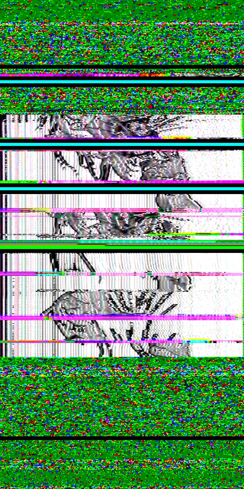
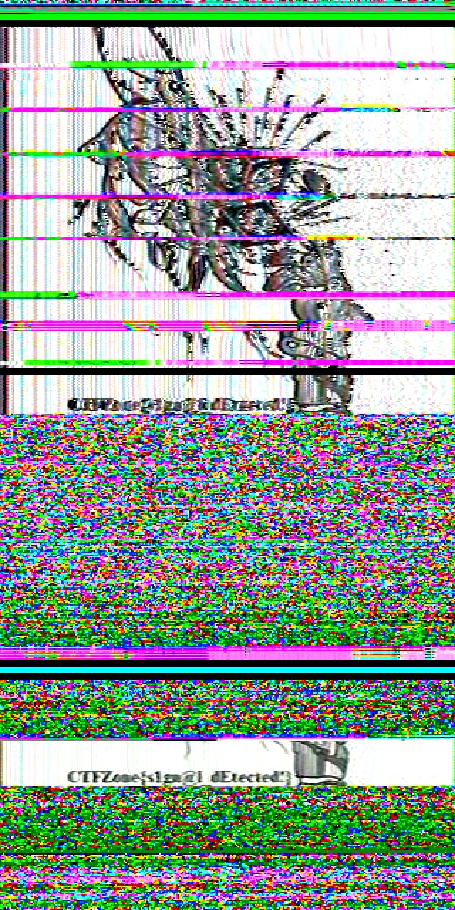

# Cube Sounds

## Problem

A strange signal was intercepted from the far side of the Moon by our Robot36 system. Perhaps this signal is the television of the future…

Who knows what is being transmitted. Maybe this is how extraterrestrial forces want to share their secrets with us?

[File](https://storage.yandexcloud.net/ctf/CubeSounds.zip.17a6cddc3df7774b99403f01cfb094af)

## Solution

When we download the link, we get several wav files

```
└─$ ls -l
total 7664
-rw-rw-r-- 1 kali kali  880524 Jul 16 23:05 1.wav
-rw-rw-r-- 1 kali kali  683260 Jul 16 23:08 10.wav
-rw-rw-r-- 1 kali kali 1152044 Jul 16 23:07 2.wav
-rw-rw-r-- 1 kali kali  520364 Jul 16 23:10 3.wav
-rw-rw-r-- 1 kali kali  851156 Jul 16 23:06 4.wav
-rw-rw-r-- 1 kali kali  268844 Jul 16 23:32 5.wav
-rw-rw-r-- 1 kali kali 1039280 Jul 16 23:01 6.wav
-rw-rw-r-- 1 kali kali  691244 Jul 16 23:32 7.wav
-rw-rw-r-- 1 kali kali  883024 Jul 16 23:04 8.wav
-rw-rw-r-- 1 kali kali  861960 Jul 16 23:02 9.wav
```

we could join them using online tool like the following https://www.happyscribe.com/audio-tools/wav-joiner

we then download an app from playstore called robot36, open the app, then we listen to the played joined wav sound. Here's what we get:



when we try reordering the files then join them into 1 wav file, then listen to it again, we get the following:



FLAG: `CTFZone{s1gn@l_dEtected!}`
