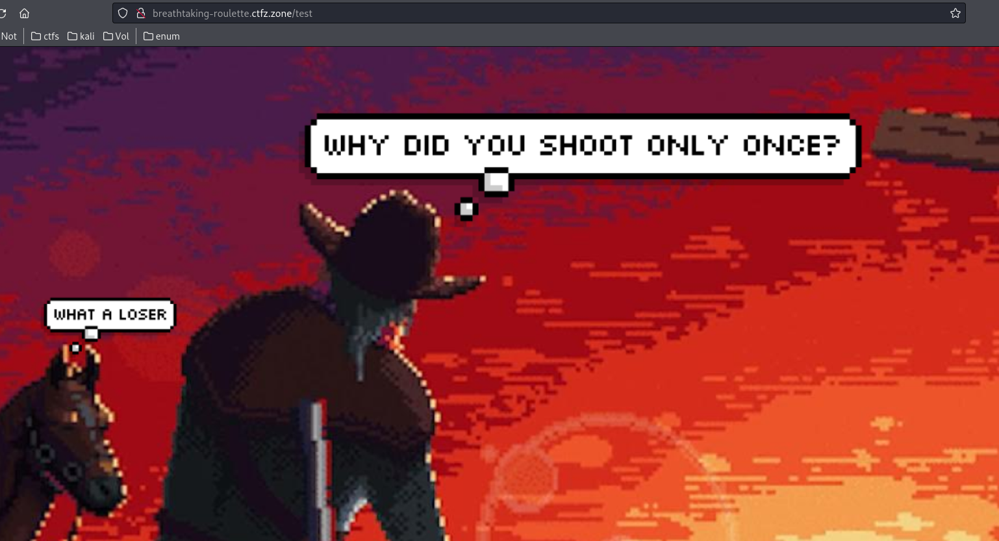
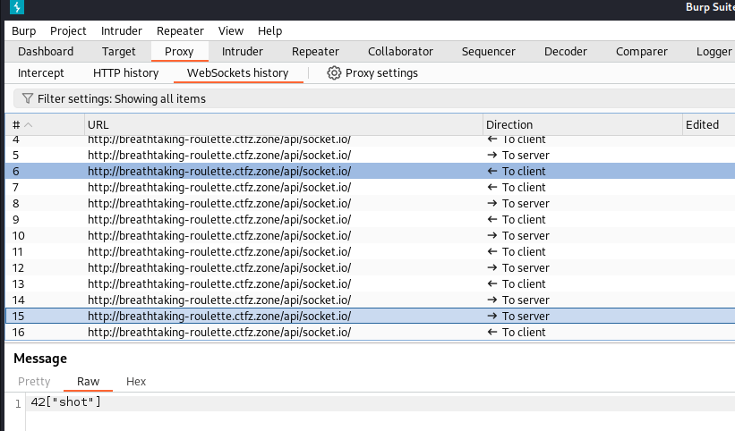
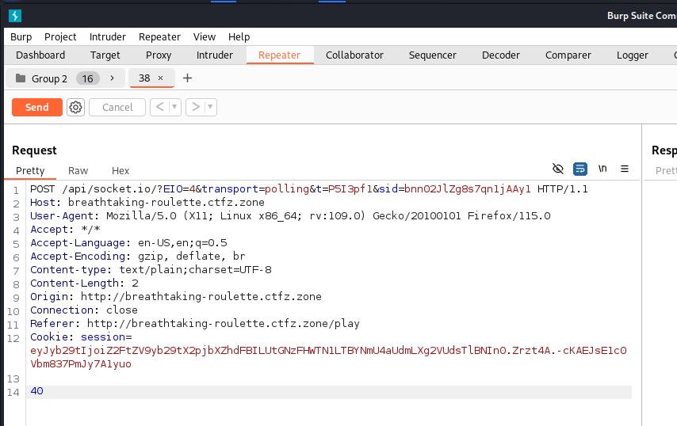
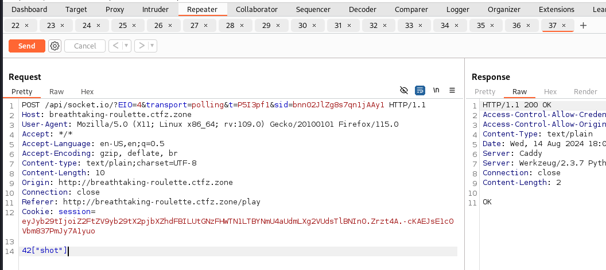
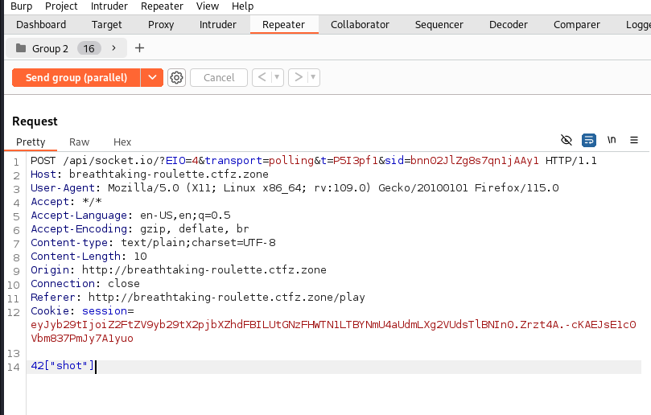
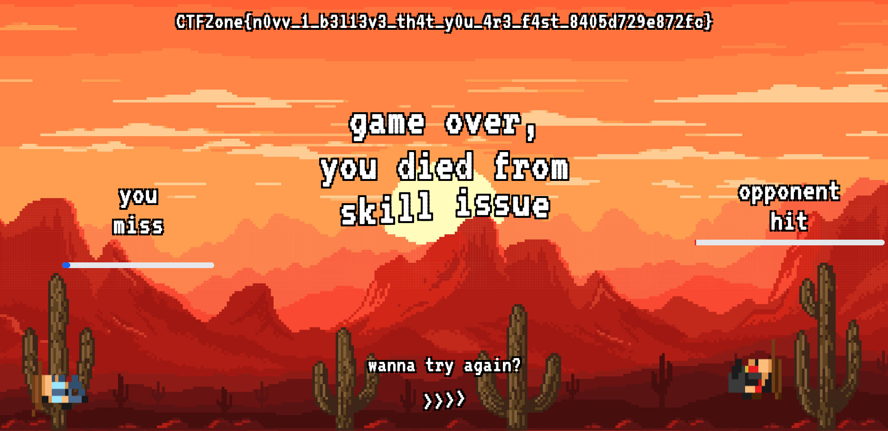

# Breathtaking Roulette

## Problem

Are you the fastest cowboy here?

instance: http://breathtaking-roulette.ctfz.zone/

## Solution

Here, we're given a game where when we start the game, we're only able to shoot once using spacebar and no matter what, we're always gonna lose or miss the shot.

There's also a hint in the website when we go to a page that doesn't exist for example http://breathtaking-roulette.ctfz.zone/test there, we're given a hint "why did you shoot only once". This basically means we have to shoot multiple times in a short period of time

When we use burpsuite to catch the traffics, we're gonna see a bunch of socket requests and responses, this means the game uses socket.io. We'll have to hack the socket.

We know that the request for shooting is `42["shot"]`

What we can do is we can try doing race condition vulnerability attack using burpsuite. Here are the steps:

1. add the request to repeater

   

2. change the request from `40` to `42["shot"]` then duplicate the requests 20 times by pressing `ctrl + r`

   

3. group the requests

   

4. send group requests in parallel

   

FLAG: `CTFZone{n0vv_1_b3l13v3_th4t_y0u_4r3_f4st_8405d729e872fc}`
